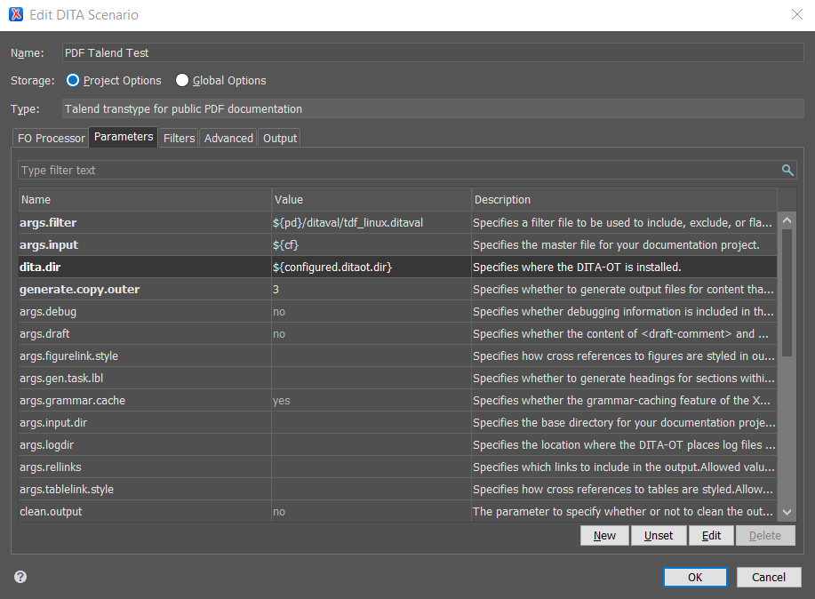

## Configuring Oxygen

To be able to build Talend PDFs locally, your first need to configure a custom transformation scenario in Oxygen.

1. Open Oxygen and access **Options** > **Preferences**.
2. In the **DITA** node of the preferences, make sure that the **DITA Open Toolkit** section is set to **Custom** and that the **Location** field points to Talend custom DITA-OT: ``C:\git\documentation-dita\build\DITA-OT``.
3. Save and exit the preferences.
2. Open a Ditamap.
3. Select **Configure Transformation Scenario(s)** > **New** > **DITA-OT transformation**.
4. Select **Talend transtype for public PDF documentation** and click **OK**.
5. In the window that opens, access the **Parameters** tab and set the following parameters. Leave the other parameters with their default value.
  * **args.filter**: ``${pd}/ditaval/tdf_linux.ditaval``
  * **args.input**: ``${cf}``
  * **dita.dir**: ``${configured.ditaot.dir}``
  * **generate.copy.outer**: ``3``

6. Give a proper **Name** to the new scenario, then click **OK** to save it.

You can now use this scenario to build Talend PDFs.

## Applying the transformation

Once a custom PDF transformation scenario is created, you can build your dita maps locally very quickly.

1. Open a dita map in the **DITA Maps Manager** view.
2. Select **Configure Transformation Scenario(s)**, then select the <a href="#pookie">custom PDF scenario created earlier</a>.
> **Note**:
> Make sure that only the scenarios you want to apply are selected.
3. Click **Apply associated** to start the transformation. If successful, the PDF opens autmatically. If not, an error log is displayed in Oxygen.

You can now check the content of the PDF. Use the [PDF Checklist](pdf_checklist.md) to check for common errors in PDFs.

## Read also

* [PDF Checklist](pdf_checklist.md)
