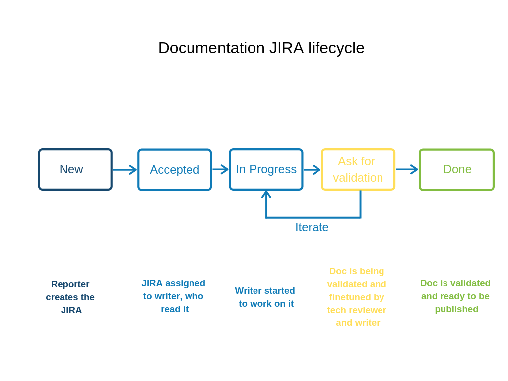

Talend uses JIRA to keep track of bugs, improvements, new features, etc. Each module/product has a JIRA project.

The documentation team uses the DOCT project to track documentation issues.

## Creating a documentation JIRA ticket

If you find something incorrect in the documentation, or if you think of anything that would need more documentation on a project you are working on, you have two options to create the issue in JIRA:

* If there is a documentation team member assigned to your project, create an issue in the relevant project and assign it to this person.
* If not, or if you are not sure if it would fit in your usual project, create a DOCT issue.

1. Create a new issue.
2. Select the **Documentation (DOCT)** project.
3. Select the relevant issue type.
4. Enter a clear title (**Summary**).
5. Fill the description with as many details as possible (links, information to add, what needs to be corrected, etc.).
6. If necessary, set a priority level.

> **Note**: Leave the other fields blank. Someone from the documentation team will assign the JIRA issue and fill the other relevant fields, like fix version.

## Documentation JIRA lifecycle

 All DOCT issues follow the same workflow. Once a JIRA is closed or done, it does not necessarily mean that the documentation is published, but that it is at least ready to be published. Publications happen for each product release or through hotfixes when needed.

 
